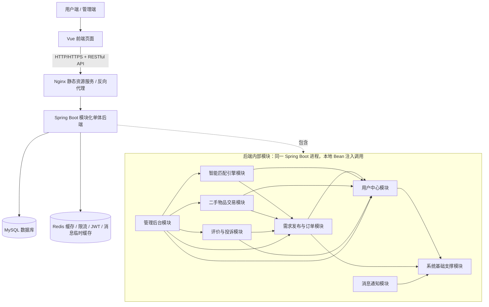
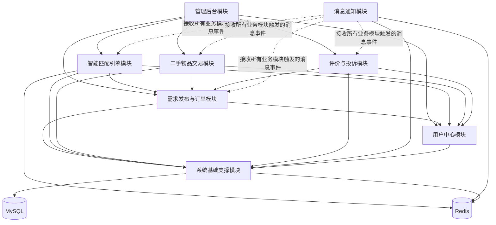

# 校园互助平台架构设计文档

> 阶段：Phase 2  
> 任务：任务 4：架构文档编写  
> 文档格式：Markdown，可直接上传至 GitHub  
> 适用范围：校园互助平台后端架构、模块划分、技术选型与 ADR 汇总

---

## 1. 架构概览

### 1.1 架构目标

校园互助平台面向校内互助服务场景，主要支持用户注册登录、校园身份认证、需求发布、智能匹配、二手交易、评价投诉、消息通知和后台管理等功能。

结合项目周期、团队规模和部署条件，本项目采用 **模块化单体架构（Modular Monolith）**：

- 后端整体部署为一个 Spring Boot 应用；
- 各业务模块在代码层面按包结构和 Service 接口进行隔离；
- 模块之间通过 Spring 本地 Bean 注入完成调用；
- 不拆分微服务，不使用 Feign、HTTP、MQ 等远程调用方式；
- 前后端之间通过 RESTful HTTP 接口交互；
- 数据存储使用 MySQL，缓存、限流、匹配结果缓存和消息临时缓存使用 Redis；
- 部署方式采用单服务器 + Docker 容器化部署。

该架构可以降低开发、测试、部署和运维复杂度，适合 10 周开发周期、4 人团队和校园项目的规模。

### 1.2 总体架构图



### 1.3 后端调用方式

本项目后端采用模块化分层单体，不拆分微服务，因此模块之间采用如下调用方式：

- 模块之间使用 Spring 本地 Bean 注入 Service 接口；
- 不使用 Feign；
- 不使用模块间 HTTP 调用；
- 不使用外部 MQ 进行模块间解耦；
- 仅前端与后端之间使用 RESTful HTTP 接口交互。

统一返回格式如下：

```json
{
  "code": 200,
  "msg": "操作成功",
  "data": {},
  "timestamp": 1712345678901
}
```

返回码约定：

| 类型 | 说明 |
|------|------|
| 200 | 请求成功 |
| 4xx | 业务失败，例如参数错误、权限不足、状态不合法 |
| 5xx | 系统异常，例如数据库异常、服务内部错误 |

---

## 2. 模块划分说明

### 2.1 模块依赖图



### 2.2 模块清单

| 序号 | 模块 | 职责边界 | 主要依赖 |
|------|------|----------|----------|
| 1 | 系统基础支撑模块 | 全局统一异常处理、统一返回封装、登录认证、JWT 令牌、权限拦截、角色权限控制、校园实名认证、学号/学院信息校验、全局字典、常量、通用工具类、分页封装、接口限流、跨域配置、全局配置参数 | 无外部业务依赖，为所有模块提供基础支撑 |
| 2 | 用户中心模块 | 用户注册、登录、个人信息管理、校园身份认证、头像和资料编辑、信用分计算、奖惩记录、信用分查询、用户标签管理 | 系统基础支撑模块 |
| 3 | 需求发布与订单模块 | 快递代取、学习辅导、二手求购/出售、活动组队、校园跑腿等需求发布；需求状态流转；互助订单创建；订单生命周期管理；需求列表、筛选、收藏、我的发布、我的接单 | 系统基础支撑模块、用户中心模块 |
| 4 | 智能匹配引擎模块 | 基于用户标签、校园位置距离和信用分门槛实现规则匹配；接收用户需求并自动推荐合适接单者；支持匹配规则配置和权重配置；匹配结果缓存至 Redis | 系统基础支撑模块、用户中心模块、需求发布与订单模块、Redis |
| 5 | 二手物品交易模块 | 二手商品发布、分类管理、商品上下架、商品详情、留言咨询、交易意向沟通、商品类目管理、违规信息初步过滤 | 用户中心模块、需求发布与订单模块、系统基础支撑模块 |
| 6 | 评价与投诉模块 | 互助完成后的双向评价、星级评分、评价记录归档、口碑展示、投诉提交、管理员审核处理、违规用户标记、评价数据同步更新用户信用分 | 用户中心模块、需求发布与订单模块、系统基础支撑模块 |
| 7 | 消息通知模块 | 系统消息、订单状态通知、匹配成功通知、评价提醒、小程序订阅消息、站内信、消息列表、已读/未读状态管理、Redis 消息临时缓存 | 所有业务模块、系统基础支撑模块、Redis |
| 8 | 管理后台模块 | 后台管理员账号、权限菜单管理、全校数据统计、内容审核、违规需求审核、违规商品审核、违规用户封禁、平台规则配置、匹配参数后台配置 | 所有模块 |

### 2.3 主要接口边界

本节只列出核心接口方向，具体字段可在接口文档阶段继续细化。

#### 2.3.1 系统基础支撑模块

| 接口方向 | 示例接口 | 说明 |
|----------|----------|------|
| 登录认证 | `POST /api/base/auth/login` | 管理登录认证 |
| 全局配置 | `GET /api/base/config/get/{configKey}` | 获取系统配置 |
| 接口限流 | 内部拦截器 | 对登录、发布、匹配等高频接口做限流 |
| 异常处理 | 全局异常处理器 | 统一处理业务异常和系统异常 |

#### 2.3.2 用户中心模块

| 接口方向 | 示例接口 | 说明 |
|----------|----------|------|
| 用户注册 | `POST /api/user/auth/register` | 用户注册 |
| 用户登录 | `POST /api/user/auth/login` | 用户登录并获取令牌 |
| 用户资料 | `GET /api/user/profile` | 查询个人信息 |
| 用户标签 | `GET /api/user/tag/list` | 查询用户标签 |
| 信用分 | `GET /api/user/credit/score` | 查询用户信用分 |
| 信用分更新 | `POST /api/user/credit/update` | 供评价与投诉模块调用 |

#### 2.3.3 需求发布与订单模块

| 接口方向 | 示例接口 | 说明 |
|----------|----------|------|
| 发布需求 | `POST /api/order/demand/create` | 发布互助需求 |
| 需求列表 | `GET /api/order/list` | 查询需求和订单列表 |
| 状态变更 | `PUT /api/order/status/change` | 修改待匹配、已接单、进行中、已完成、取消等状态 |
| 订单详情 | `GET /api/order/detail/{orderId}` | 查询订单详情 |

#### 2.3.4 智能匹配引擎模块

| 接口方向 | 示例接口 | 说明 |
|----------|----------|------|
| 执行匹配 | `POST /api/match/demand/user` | 根据需求推荐合适接单者 |
| 匹配规则 | `GET /api/match/rule` | 查询匹配规则 |
| 规则配置 | `POST /api/match/rule/config` | 配置标签、距离、信用分等权重 |

#### 2.3.5 二手物品交易模块

| 接口方向 | 示例接口 | 说明 |
|----------|----------|------|
| 商品发布 | `POST /api/second/goods/publish` | 发布二手商品 |
| 商品分类 | `GET /api/second/category/list` | 查询二手商品分类 |
| 交易沟通 | `POST /api/second/consult/transfer` | 留言咨询或交易意向沟通 |

#### 2.3.6 评价与投诉模块

| 接口方向 | 示例接口 | 说明 |
|----------|----------|------|
| 创建评价 | `POST /api/evaluate/create` | 互助完成后进行双向评价 |
| 信用回调 | `POST /api/evaluate/credit/callback` | 触发用户信用分更新 |
| 投诉提交 | `POST /api/complaint/submit` | 提交投诉 |

#### 2.3.7 消息通知模块

| 接口方向 | 示例接口 | 说明 |
|----------|----------|------|
| 消息发送 | `POST /api/message/send` | 发送系统消息、订单通知、匹配通知等 |
| 消息列表 | `GET /api/message/list` | 查询消息列表 |
| 已读状态 | `PUT /api/message/read` | 更新已读/未读状态 |

#### 2.3.8 管理后台模块

| 接口方向 | 示例接口 | 说明 |
|----------|----------|------|
| 数据看板 | `GET /api/admin/dashboard/stat` | 查询发布量、成交量、活跃用户、交易热度等统计数据 |
| 权限配置 | `POST /api/admin/permission/config` | 配置后台权限菜单 |
| 数据查询 | `GET /api/admin/data/query` | 查询业务数据和审核数据 |
| 内容审核 | `POST /api/admin/audit/handle` | 审核违规需求、商品和用户 |

---

## 3. 技术选型说明

### 3.1 技术栈总览

| 层次 | 技术选型 | 使用位置 | 选择理由 |
|------|----------|----------|----------|
| 前端框架 | Vue | 用户端页面、管理后台页面 | 团队成员已有基础了解；适合组件化开发；较轻量，便于快速实现页面 |
| 前端组件库 | Element Plus | 管理后台、表单、表格、弹窗等页面组件 | 降低后台页面开发成本，提高界面一致性 |
| 后端框架 | Spring Boot | 后端主体应用 | 自动配置与起步依赖降低搭建成本；内嵌服务器便于独立运行；适合模块化单体开发 |
| 后端架构 | 模块化单体 | 所有后端业务模块 | 适合 10 周周期和 4 人团队，降低分布式开发、测试和部署复杂度 |
| 数据库 | MySQL / SQL | 用户、订单、需求、商品、评价、投诉、后台配置等核心数据 | 适用于中小型 Web 应用；易部署、易维护；满足单服务器部署条件 |
| ORM / 数据访问 | MyBatis-Plus | CRUD、分页、条件查询 | 减少重复代码，提升基础数据访问开发效率 |
| 缓存与中间件 | Redis | 匹配结果缓存、接口限流、JWT/登录态辅助、消息临时缓存 | 支持多种数据结构；内存存储；高读写效率；适合高频读取和限流场景 |
| 认证授权 | JWT + 权限拦截 | 登录认证、角色权限控制、后台权限管理 | 适合前后端分离接口调用；便于在接口层统一鉴权 |
| 接口文档 | Swagger / Knife4j | RESTful API 文档 | 便于前后端联调和接口管理 |
| Web 服务 | Nginx | 静态资源服务、反向代理 | 统一承接前端访问和后端接口转发 |
| 部署方式 | 单服务器 + Docker 容器化 | MySQL、Redis、后端 Jar、Nginx | 低成本、易维护；Docker 保证环境一致性；便于一键部署和迁移 |
| 构建与运行 | Maven + JDK 17 | 后端构建和运行 | 适合 Spring Boot 项目构建和依赖管理 |

### 3.2 关键选型说明

#### 3.2.1 采用模块化单体而非微服务

本项目包含用户中心、需求订单、智能匹配、二手交易、评价投诉、消息通知、管理后台等多个模块，但项目周期较短、团队规模较小、部署环境为单服务器 Docker 容器化。若拆分微服务，会额外引入服务注册发现、远程调用、分布式事务、链路追踪、服务运维等复杂度。

因此，后端采用一个 Spring Boot 应用承载全部业务模块，各模块通过包结构和 Service 接口隔离，运行时仍处于同一进程内，模块间采用本地方法调用。

#### 3.2.2 使用 Redis 支撑缓存与限流

智能匹配需要根据用户标签、校园位置和信用分等信息进行计算，在任务列表刷新和推荐场景下可能产生较高读写压力。Redis 用于缓存匹配结果，减少重复计算和 MySQL 高频读取。

同时，Redis 还用于登录令牌辅助管理、接口限流计数器和消息临时缓存，能支撑“轻量高性能”的技术要求。

#### 3.2.3 信用分更新采用本地 Service 调用

评价与投诉模块在订单完成后需要同步更新用户中心模块中的信用分。考虑到当前系统是单体部署，为了降低系统复杂度，不引入 RabbitMQ、Kafka 等外部消息队列。

当评价归档后，由评价与投诉模块直接调用用户中心模块提供的 `updateCreditScore` 相关接口，保证信用分更新逻辑简单、可测试，并符合当前单体架构设计。

#### 3.2.4 单服务器 Docker 容器化部署

部署层面采用单服务器 + Docker 容器化方式，将 MySQL、Redis、Spring Boot 后端 Jar、Nginx 等组件容器化，通过 Docker Compose 统一编排和启动。

该方式部署成本低、环境一致性较好，符合校园项目和课程作业的交付条件。

---

## 4. ADR 集合

### ADR-001：采用模块化单体架构（Modular Monolith）

#### 状态

已接受

#### 背景

项目需要在 10 周内交付，且部署方式已确定为单服务器 Docker 容器化。系统包含用户中心、匹配引擎、需求订单、二手交易、评价投诉、消息通知和管理后台等多个业务模块，但团队规模较小，需要优先降低运维与开发复杂度。

#### 决策

项目不采用微服务架构，采用模块化单体架构。

各业务模块在代码层面通过包结构进行逻辑隔离，但运行层面处于同一个 Spring Boot 进程中。模块之间通过本地 Spring Bean 注入 Service 接口实现调用。

#### 理由

1. **可行性更高**：避免微服务带来的分布式事务、服务发现、远程调用复杂度，有利于在规定时间内完成设计和实现。
2. **性能更合适**：本地方法调用避免远程网络请求，适合单服务器部署环境。
3. **团队一致性更强**：符合“不拆分微服务、同进程内本地方法调用”的技术共识。

#### 后果

**正面影响：**

- 简化 CI/CD 流程和本地调试过程；
- 降低部署、测试和联调成本；
- 更适合课程项目和校园中小型系统。

**负面影响：**

- 模块之间仍可能出现代码级耦合；
- 后续若要独立扩展特定模块，需要进行模块重构。

**风险：**

- 需要严格执行包管理规范；
- 需要避免模块之间出现循环依赖；
- Service 接口边界需要保持清晰。

#### AI 辅助记录

- **AI 初稿内容摘要：** 推荐使用 Spring Cloud 微服务架构，以应对校园高并发场景。
- **人工修订内容：** 改为模块化单体架构，并明确通过 Service 接口进行本地调用。
- **修订理由：** AI 忽略了学生项目的人力瓶颈和部署成本；微服务会在项目环境搭建阶段消耗大量工时，不符合可行性原则。

---

### ADR-002：利用 Redis 实现智能匹配缓存与接口限流

#### 状态

已接受

#### 背景

智能匹配引擎需要根据用户标签、校园位置、信用分等维度进行复杂计算，计算开销较大。同时，系统在基础支撑模块中需要实现接口限流，防止恶意抢单或暴力登录。

#### 决策

引入 Redis 作为核心中间件。

Redis 主要用于：

- 缓存智能匹配引擎的计算结果；
- 管理用户登录相关的 JWT/登录态辅助数据；
- 实现全局接口限流计数器；
- 为消息通知模块提供临时消息缓存。

#### 理由

1. **提升体验**：将匹配结果缓存至 Redis，可使任务列表刷新和推荐结果返回更快。
2. **多功能复用**：单个中间件可同时支持缓存、登录态辅助、限流和消息临时存储，符合轻量高性能要求。
3. **适配部署方式**：Redis 易于通过 Docker 容器部署，适合当前单服务器容器化方案。

#### 后果

**正面影响：**

- 降低 MySQL 在高频筛选任务时的读写压力；
- 提升匹配结果读取和接口限流处理效率；
- 为后续扩展分布式部署保留一定弹性。

**负面影响：**

- 系统增加了对 Redis 的外部组件依赖；
- 需要处理缓存过期、缓存一致性和 Redis 宕机降级问题。

**风险：**

- 匹配结果缓存失效策略需要设计清楚；
- 限流 Key 命名和过期时间需要统一规范。

#### AI 辅助记录

- **AI 初稿内容摘要：** 建议使用本地缓存，例如 Caffeine，以进一步减少架构层级。
- **人工修订内容：** 坚持使用 Redis，并将其职责扩展到限流和消息临时存储。
- **修订理由：** 考虑到未来可能的分布式部署需求，Redis 比本地缓存更具备扩展性，也更好配合 Docker 容器化部署。

---

### ADR-003：基于本地 Service 调用的信用分更新策略

#### 状态

已接受

#### 背景

评价与投诉模块在订单完成后，需要同步更新用户中心模块中的用户信用分。在单体架构下，系统需要保证数据同步的实时性与一致性，同时避免引入过度复杂的外部组件。

#### 决策

不引入复杂的外部消息队列，而采用 Spring 本地 Service 调用。

当评价归档后，评价与投诉模块直接调用用户中心模块提供的 `updateCreditScore` 接口，完成信用分更新。

#### 理由

1. **原子性保证**：在同一个数据库事务中，通过本地调用可以确保“评价提交”和“信用分更新”同时成功或回滚，保证信用体系严谨性。
2. **架构一致性**：符合项目中“模块间不使用 MQ 远程调用”的开发原则。
3. **实现成本更低**：本地 Service 调用开发逻辑简单，调试成本低，能快速响应阶段性交付要求。

#### 后果

**正面影响：**

- 开发逻辑简单；
- 调试成本低；
- 能快速满足项目交付要求。

**负面影响：**

- 增加评价与投诉模块和用户中心模块之间的逻辑耦合；
- 若未来拆分服务，需要重新设计信用分更新链路。

**风险：**

- 需要明确用户中心模块对外暴露的信用分更新接口；
- 需要避免评价模块直接操作用户表，保证模块边界清晰。

#### AI 辅助记录

- **AI 初稿内容摘要：** 推荐使用 RabbitMQ 或 Kafka 实现评价与信用分模块解耦。
- **人工修订内容：** 改为直接 Service 注入调用。
- **修订理由：** 在单服务器单体应用中，引入 MQ 会增加消息丢失风险和系统复杂度，属于过度设计，不利于项目快速落地。

---

## 5. 小结

本架构设计以“可落地、低复杂度、易部署”为主要原则，采用模块化单体架构组织后端业务，通过 MySQL 保证核心业务数据持久化，通过 Redis 支撑缓存、限流、匹配结果缓存和消息临时缓存，通过 Docker 容器化降低部署成本。

该设计符合校园互助平台的业务范围、团队规模、开发周期和单服务器部署条件。后续实现阶段需要重点控制模块边界，避免循环依赖，并保持 Service 接口和统一返回格式的一致性。
