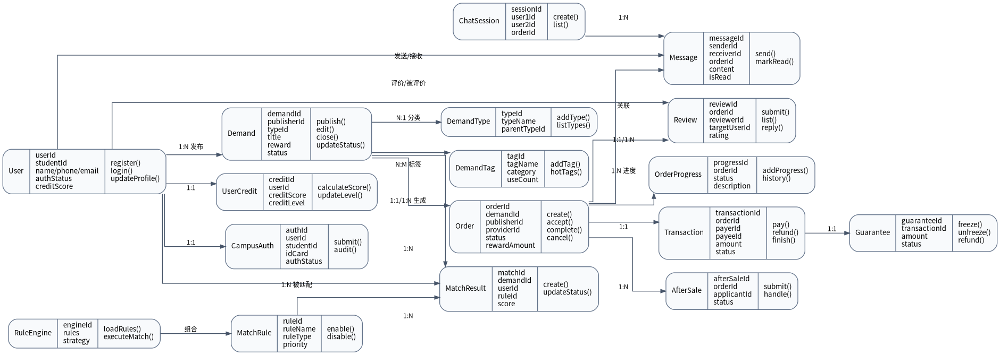
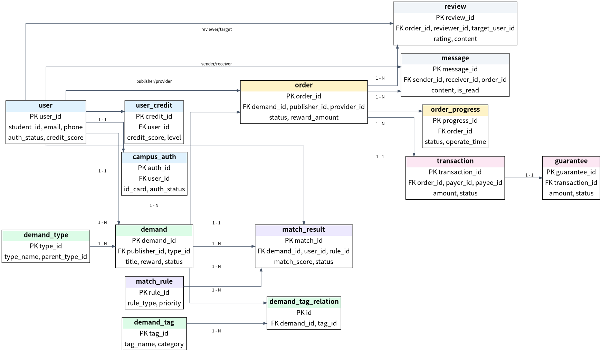

# 详细设计文档（整合版）

**阶段：Phase 3 - 详细设计**  
**团队：二元一次方程组**  
**日期：2026年5月17日**  
**整合范围：任务1 类图与SOLID检查、任务2 API设计、任务3 数据库设计、任务4 详细设计文档整合、AI协作反思日志 #3**

## 1. 文档目标与范围

本文件用于完成 Phase 3 的“设计文档整合”任务，将任务1、任务2、任务3的成果合并为一份可提交到 `docs/P3/` 目录的详细设计文档。文档重点覆盖：核心类图设计、SOLID检查结果、设计模式应用、API接口规范、数据库ER设计、建表SQL、AI辅助审查和AI协作反思日志。

本阶段的设计目标包括：

1. 完成类图设计，确保核心模块覆盖 P0 功能，并符合 SOLID 原则。
2. 定义核心 API 接口规范，统一请求、响应、错误码和认证方式。
3. 完成数据库设计，明确实体关系、主键外键、索引和隐私数据处理方案。
4. 通过 SOLID 检查实验总结 AI 在设计层面的优势与边界。

## 2. 核心类图设计

### 2.1 类图总览

下图用于展示系统核心类之间的主要关系。图中仅展示关键属性、关键方法和核心关联，完整属性与方法见 2.2 表格。



### 2.2 核心类清单

|模块|类名|核心属性|核心方法|类间关系|
|---|---|---|---|---|
|用户模块|User|用户ID、学号、姓名、手机号、邮箱、校园认证状态、信用分、角色、注册时间|注册、登录、更新个人信息、校园认证、更新信用分|1对1关联UserCredit；1对多关联Demand；1对多关联Order；1对多关联Review|
|用户模块|UserCredit|信用记录ID、用户ID、信用分、信用等级、评价记录、违规记录、更新时间|计算信用分、更新信用等级、添加信用记录、查询信用历史|1对1属于User；1对多关联Review|
|用户模块|CampusAuth|认证ID、用户ID、学号、身份证号、学生证照片、认证状态、审核时间、审核人|提交认证、审核认证、查询认证状态、更新认证信息|1对1属于User|
|需求模块|Demand|需求ID、发布者ID、需求类型、标题、内容、标签、位置、报酬、截止时间、发布时间、状态|发布需求、编辑需求、关闭需求、查询需求、更新状态|多对一属于User；1对多关联Order；多对多关联DemandTag；1对多关联MatchResult|
|需求模块|DemandType|类型ID、类型名称、父类型ID、排序、状态|新增类型、编辑类型、查询类型列表|1对多关联Demand|
|需求模块|DemandTag|标签ID、标签名称、标签分类、使用次数|新增标签、编辑标签、查询热门标签|多对多关联Demand|
|订单模块|Order|订单ID、需求ID、发布者ID、接单者ID、订单状态、创建时间、接单时间、完成时间、取消时间、报酬金额|创建订单、接单、取消订单、完成订单、更新订单状态、查询订单详情|多对一属于Demand；多对一关联User（发布者）；多对一关联User（接单者）；1对1关联Transaction；1对多关联OrderProgress；1对1关联Review|
|订单模块|OrderProgress|进度ID、订单ID、进度状态、进度描述、操作人、操作时间|新增进度、更新进度、查询进度历史|多对一属于Order|
|订单模块|OrderStatus|状态ID、状态名称、状态编码、排序|查询状态列表、获取状态详情|1对多关联Order|
|交易模块|Transaction|交易ID、订单ID、支付者ID、收款者ID、交易金额、交易类型、支付方式、交易状态、创建时间、支付时间、完成时间|创建交易、支付、退款、完成交易、更新交易状态、查询交易流水|1对1属于Order；多对一关联User（支付者）；多对一关联User（收款者）；1对1关联Guarantee|
|交易模块|Guarantee|担保ID、交易ID、担保金额、担保状态、创建时间、解冻时间、退款金额|创建担保、解冻担保、退款担保、更新担保状态|1对1属于Transaction|
|交易模块|AfterSale|售后ID、订单ID、申请人ID、被申请人ID、售后类型、售后原因、售后状态、申请时间、处理时间、处理结果|提交售后申请、处理售后、更新售后状态、查询售后详情|多对一属于Order|
|匹配模块|MatchRule|规则ID、规则名称、规则类型、规则表达式、优先级、状态、创建时间|新增规则、编辑规则、启用/禁用规则、查询规则列表|1对多关联MatchResult|
|匹配模块|MatchResult|匹配ID、需求ID、匹配用户ID、匹配规则ID、匹配度、匹配状态、匹配时间|创建匹配结果、更新匹配状态、查询匹配结果|多对一属于Demand；多对一属于User；多对一属于MatchRule|
|匹配模块|RuleEngine|引擎ID、引擎名称、规则列表、执行策略|加载规则、执行匹配、计算匹配度、返回匹配结果|组合多个MatchRule|
|沟通模块|Message|消息ID、发送者ID、接收者ID、订单ID、消息内容、消息类型、发送时间、阅读状态|发送消息、查询消息列表、标记已读、删除消息|多对一关联User（发送者）；多对一关联User（接收者）；多对一关联Order|
|沟通模块|ChatSession|会话ID、用户1ID、用户2ID、订单ID、最后消息时间、创建时间|创建会话、查询会话列表、更新最后消息时间|1对多关联Message；多对一关联Order|
|评价模块|Review|评价ID、订单ID、评价者ID、被评价者ID、评分、评价内容、评价时间、匿名状态|提交评价、查询评价列表、删除评价、回复评价|1对1属于Order；多对一关联User（评价者）；多对一关联User（被评价者）；1对1关联UserCredit|


### 2.3 类间关系摘要


- 用户域：`User` 与 `UserCredit`、`CampusAuth` 为一对一关系，用户与需求、订单、评价、消息为一对多关系。
- 需求域：`Demand` 由用户发布，归属于 `DemandType`，可关联多个 `DemandTag`；需求可被接单并生成订单。
- 订单域：`Order` 关联需求、发布者和接单者，使用 `OrderProgress` 记录状态流转，完成后进入评价。
- 交易域：`Transaction` 与订单一对一，`Guarantee` 与交易一对一，用于担保支付和退款处理。
- 匹配域：`RuleEngine` 组合多个 `MatchRule`，产生 `MatchResult`，用于推荐潜在接单用户。
- 沟通与评价域：`ChatSession` 聚合 `Message`，`Review` 绑定订单并影响 `UserCredit`。


## 3. SOLID 原则检查清单

AI 原始设计经团队逐条检查后，发现 5 处违反 SOLID 原则的问题。团队已根据检查清单完成拆分、抽象、接口细化和依赖倒置修正。

|SOLID原则|检查问题|AI设计是否违反|违反说明|修正方案|修正后验证结果|
|---|---|---|---|---|---|
|S - 单一职责|有没有类承担了过多职责？|是|AI原始设计中，User类同时承担了用户信息管理、校园认证、信用分管理、消息通知等多个职责，违反了单一职责原则|1. 将校园认证功能拆分到CampusAuth类；2. 将信用分管理拆分到UserCredit类；3. 将消息通知拆分到Message类；4. User类仅保留用户基础信息管理的核心职责|修正后，每个类仅承担一个核心职责，类的复杂度降低，可维护性提升，符合单一职责原则|
|O - 开闭原则|新增需求类型是否需要修改现有代码？|是|AI原始设计中，DemandType类的类型判断使用了硬编码的if-else逻辑，新增需求类型时需要修改现有代码，违反了开闭原则|1. 引入策略模式，将不同需求类型的处理逻辑封装为独立的策略类；2. DemandType类仅保留类型基础信息，处理逻辑由对应的策略类实现；3. 新增需求类型时，仅需新增对应的策略类，无需修改现有代码|修正后，新增需求类型无需修改现有核心代码，仅需扩展新的策略类，符合开闭原则|
|L - 里氏替换|子类是否可以替换父类使用？|是|AI原始设计中，Order类的子类NormalOrder和UrgentOrder重写了父类的updateStatus方法，改变了方法的前置条件，导致子类无法完全替换父类使用，违反了里氏替换原则|1. 规范子类重写方法的规则，确保子类方法的前置条件不弱于父类，后置条件不弱于父类；2. 提取公共的订单状态更新逻辑到父类，子类仅扩展个性化的状态校验逻辑，不改变核心流程；3. 确保所有子类都可以完全替换父类，不影响原有程序的正确性|修正后，所有子类都可以完全替换父类使用，程序行为保持一致，符合里氏替换原则|
|I - 接口隔离|有没有接口太"胖"，包含了不需要的方法？|是|AI原始设计中，UserService接口包含了用户信息管理、校园认证、信用分管理、消息通知等所有相关方法，导致实现该接口的类必须实现所有不需要的方法，违反了接口隔离原则|1. 拆分胖接口为多个独立的细粒度接口：UserInfoService、CampusAuthService、UserCreditService、MessageService；2. 每个接口仅包含对应职责的相关方法；3. 实现类仅需要实现自己需要的接口，无需实现无关的方法|修正后，接口被拆分为多个细粒度的独立接口，实现类仅需实现自己需要的方法，符合接口隔离原则|
|D - 依赖倒转|高层模块是否直接依赖了低层模块的具体实现？|是|AI原始设计中，OrderService高层模块直接依赖了TransactionRepository低层模块的具体实现，而不是依赖抽象接口，导致高层模块与低层模块耦合度高，违反了依赖倒转原则|1. 定义TransactionRepository接口，抽象数据访问的核心方法；2. OrderService高层模块仅依赖TransactionRepository接口，不依赖具体实现；3. 低层模块实现TransactionRepository接口，通过依赖注入的方式注入到OrderService中|修正后，高层模块仅依赖抽象接口，不依赖低层模块的具体实现，模块间耦合度降低，可替换性提升，符合依赖倒转原则|


## 4. 设计模式应用说明

本系统至少应用了 2 种设计模式。任务1中识别了策略模式、观察者模式、单例模式、工厂模式四类可用模式，其中策略模式和观察者模式直接服务于核心业务扩展与状态联动。

|设计模式名称|应用场景|模式说明|使用原因|不使用该模式的问题|
|---|---|---|---|---|
|策略模式|需求类型处理、匹配规则执行|策略模式定义了一系列算法，将每个算法封装到独立的类中，使它们可以相互替换，让算法的变化独立于使用算法的客户|1. 系统中需求类型多样，且后续会新增更多类型，每种类型的处理逻辑不同；2. 匹配规则引擎需要支持多种规则的动态切换和执行；3. 使用策略模式可以将不同的处理逻辑封装为独立的策略类，实现算法的自由切换和扩展|1. 新增需求类型或匹配规则时，需要修改现有核心代码，违反开闭原则；2. 所有处理逻辑耦合在一个类中，代码复杂度高，可维护性差；3. 无法动态切换处理逻辑，灵活性低|
|观察者模式|订单状态变更、消息通知、信用分更新|观察者模式定义了对象之间的一对多依赖关系，当一个对象的状态发生改变时，所有依赖它的对象都会得到通知并自动更新|1. 订单状态变更时，需要同步通知交易模块、消息模块、评价模块等多个相关模块；2. 用户信用分更新时，需要同步更新用户信用等级、匹配规则优先级等；3. 使用观察者模式可以实现状态变更的自动通知，降低模块间的耦合度|1. 状态变更时，需要手动调用所有相关模块的更新方法，代码冗余，易遗漏；2. 模块间耦合度高，新增依赖模块时需要修改现有代码；3. 无法实现动态的事件监听和处理，灵活性低|
|单例模式|规则引擎、数据库连接池、配置管理|单例模式确保一个类只有一个实例，并提供一个全局访问点来获取该实例|1. 规则引擎在系统中只需要一个实例，避免重复加载规则造成的资源浪费；2. 数据库连接池需要全局唯一的实例，确保连接的统一管理和复用；3. 系统配置管理需要全局唯一的实例，确保配置的统一读取和更新|1. 多个实例会导致资源重复占用，系统性能下降；2. 多个实例可能导致配置数据、规则数据的不一致；3. 无法全局统一管理对象的生命周期，易造成内存泄漏|
|工厂模式|订单对象创建、交易对象创建、消息对象创建|工厂模式定义了一个创建对象的接口，让子类决定实例化哪一个类，工厂方法使一个类的实例化延迟到其子类|1. 系统中订单分为普通订单、紧急订单、定制订单等多种类型，不同类型的订单创建逻辑不同；2. 交易分为担保交易、即时交易、退款交易等多种类型，创建逻辑不同；3. 使用工厂模式可以封装对象的创建逻辑，客户端无需知道具体的创建细节，只需通过工厂获取对象|1. 客户端需要直接创建不同类型的对象，代码耦合度高；2. 新增对象类型时，需要修改所有使用该对象的客户端代码，违反开闭原则；3. 对象创建逻辑分散在多个地方，代码冗余，可维护性差|


## 5. API 规范设计

### 5.1 API 总体约定

| 项目 | 设计约定 |
|---|---|
| 基础路径 | `/api/v1` |
| 通信格式 | JSON |
| 认证方式 | JWT Bearer Token |
| 时间格式 | ISO 8601，例如 `2026-05-20T18:00:00+08:00` |
| 统一返回 | `code`、`msg`、`data`、`timestamp` |
| 错误码规则 | HTTP状态码 + 两位业务序号，例如 `40101` 表示认证失败 |

统一返回结构：

```json
{
  "code": 200,
  "msg": "success",
  "data": {},
  "timestamp": 1712345678901
}
```

### 5.2 核心接口清单

|模块|接口|方法|路径|认证|关键请求参数|主要响应/错误码|
|---|---|---|---|---|---|---|
|用户认证|用户注册|POST|/api/v1/auth/register|无需认证，IP限流|studentId、email、password、nickname、college|200注册成功；40001学号/邮箱已存在；40002参数校验失败；42901请求过频|
|用户认证|用户登录|POST|/api/v1/auth/login|无需认证，账号限流|username、password|200登录成功，返回token、expireTime、userInfo；40101认证失败|
|需求发布与浏览|发布需求|POST|/api/v1/demands|Bearer Token，需校园认证|title、description、category、location、reward、rewardType、deadline、contactHidden、images|201/200发布成功；40002未完成校园认证/参数错误；40101未认证|
|需求发布与浏览|浏览需求列表|GET|/api/v1/demands|可选认证|page、pageSize、category、status、keyword、location、sortBy、sortOrder、minReward、maxReward|200返回total、page、list；40002参数校验失败|
|需求发布与浏览|查看需求详情|GET|/api/v1/demands/{demandId}|可选认证|demandId|200返回需求完整详情；40401需求不存在|
|订单管理|接单申请|POST|/api/v1/orders/apply|Bearer Token，信用分>=60且未完成订单<5|demandId、message|200申请成功；40003信用分不足；40901需求已被接单|
|订单管理|确认接单|POST|/api/v1/orders/confirm/{applyId}|Bearer Token，仅发布者|applyId|200创建订单；40301权限不足；40401申请不存在|
|订单管理|查看订单详情|GET|/api/v1/orders/{orderId}|Bearer Token，仅订单参与方|orderId|200返回订单、双方信息、状态历史；40301权限不足；40401订单不存在|
|订单管理|完成订单|POST|/api/v1/orders/{orderId}/complete|Bearer Token，仅服务方|orderId|200订单完成，进入评价；40301权限不足；40901状态冲突|
|评价模块|提交评价|POST|/api/v1/reviews|Bearer Token，订单参与方且订单已完成|orderId、targetUserId、rating、content、tags|200评价成功；40005重复评价；40301权限不足|
|评价模块|查看用户评价列表|GET|/api/v1/reviews/user/{userId}|可选认证|userId、page、pageSize|200返回用户评价分页列表；40401用户不存在|


### 5.3 安全与校验要求

- 注册、登录接口需要限流，避免撞库和暴力破解。
- 所有写操作接口必须校验 JWT Token，涉及发布需求、接单、确认订单、完成订单、提交评价等操作。
- 发布需求必须校验用户是否完成校园身份认证。
- 接单前需要校验信用分、未完成订单数量和需求状态，避免低信用用户或重复接单。
- 查看订单详情仅允许订单参与方访问，避免泄露双方联系信息。
- 评价接口必须校验订单状态为已完成，并通过唯一约束防止重复评价。

### 5.4 API 文档原文整合

以下内容来自任务2同学提交的 API 规范文档，保留其 RESTful 接口细节、参数说明、响应示例和错误码定义，作为本整合文档的接口明细依据。

### CampusHub API 规范文档

> **CampusHub** 是一个基于校园场景的互助服务平台，提供需求发布、订单管理、信用评价等核心功能。本文档详细描述了后端 API 接口规范。

| 项目 | 详情 |
| :--- | :--- |
| **基础路径** | `/api/v1` |
| **认证方式** | `JWT Bearer Token` |
| **数据格式** | `JSON` |
| **统一返回** | 见 [附录 A](#a-统一返回格式) |

---

#### 目录

1. [用户认证模块](#1-用户认证模块)
2. [需求发布与浏览模块](#2-需求发布与浏览模块)
3. [订单管理模块](#3-订单管理模块)
4. [评价模块](#4-评价模块)
5. [错误码定义](#5-错误码定义)
6. [附录](#附录)

---

#### 1. 用户认证模块

##### 1.1 用户注册

> **接口说明**：新用户通过学号或校园邮箱完成注册，系统将自动创建账户并返回访问令牌。

- **URL**: `/api/v1/auth/register`
- **Method**: `POST`
- **Auth**: ❌ 无需认证
- **Limit**: 同一 IP 每分钟最多 **5** 次

###### 请求参数

| 参数名 | 类型 | 必填 | 说明 | 示例 |
| :--- | :--- | :---: | :--- | :--- |
| `studentId` | String | ✅ | 学号（8-12位数字） | `"2024010001"` |
| `email` | String | ✅ | 校园邮箱（@xxx.edu.cn） | `"student@xxx.edu.cn"` |
| `password` | String | ✅ | 密码（8-20位，含字母和数字） | `"Abc12345"` |
| `nickname` | String | ✅ | 昵称（2-20字符） | `"小明"` |
| `college` | String | ⭕ | 学院名称 | `"计算机学院"` |

###### 请求示例

{
  "studentId": "2024010001",
  "email": "student@xxx.edu.cn",
  "password": "Abc12345",
  "nickname": "小明",
  "college": "计算机学院"
}

###### 响应示例

**✅ 成功 (200 OK)**

{
  "code": 200,
  "msg": "注册成功",
  "data": {
    "userId": 10001,
    "token": "eyJhbGciOiJIUzI1NiIsInR5cCI6IkpXVCJ9..."
  },
  "timestamp": 1712345678901
}

**❌ 失败 (400 Bad Request)**

{
  "code": 40001,
  "msg": "学号已存在",
  "data": null,
  "timestamp": 1712345678901
}

---

##### 1.2 用户登录

> **接口说明**：已注册用户通过学号/邮箱和密码登录系统，获取访问令牌及基础用户信息。

- **URL**: `/api/v1/auth/login`
- **Method**: `POST`
- **Auth**: ❌ 无需认证
- **Limit**: 同一账号每分钟最多 **3** 次

###### 请求参数

| 参数名 | 类型 | 必填 | 说明 | 示例 |
| :--- | :--- | :---: | :--- | :--- |
| `username` | String | ✅ | 学号或校园邮箱 | `"2024010001"` |
| `password` | String | ✅ | 登录密码 | `"Abc12345"` |

###### 请求示例

{
  "username": "2024010001",
  "password": "Abc12345"
}

###### 响应示例

**✅ 成功 (200 OK)**

{
  "code": 200,
  "msg": "登录成功",
  "data": {
    "userId": 10001,
    "token": "eyJhbGciOiJIUzI1NiIsInR5cCI6IkpXVCJ9...",
    "expireTime": 7200,
    "userInfo": {
      "nickname": "小明",
      "avatar": "https://cdn.example.com/avatar/10001.jpg",
      "creditScore": 85,
      "isVerified": true
    }
  },
  "timestamp": 1712345678901
}

**❌ 失败 (401 Unauthorized)**

{
  "code": 40101,
  "msg": "用户名或密码错误",
  "data": null,
  "timestamp": 1712345678901
}

---

#### 2. 需求发布与浏览模块

##### 2.1 发布需求

> **接口说明**：用户发布互助需求或交易需求，需完成校园身份认证。

- **URL**: `/api/v1/demands`
- **Method**: `POST`
- **Auth**: 需要认证 (Bearer Token)
- **Permission**: ✅ 已完成校园身份认证的用户

###### 请求参数

| 参数名 | 类型 | 必填 | 说明 | 示例 |
| :--- | :--- | :---: | :--- | :--- |
| `title` | String | ✅ | 需求标题（5-50字符） | `"代取快递到宿舍"` |
| `description` | String | ✅ | 详细描述（10-500字符） | `"帮忙从南门快递点取两个包裹送到3号楼"` |
| `category` | String | ✅ | 分类枚举值 | `"DELIVERY"` |
| `location` | String | ✅ | 地点描述 | `"南门快递点 -> 3号楼"` |
| `reward` | Decimal | ⭕ | 报酬金额（元），0表示互换 | `15.00` |
| `rewardType` | String | ✅ | 报酬类型：`MONEY`/`EXCHANGE` | `"MONEY"` |
| `deadline` | DateTime | ✅ | 截止时间（ISO 8601） | `"2026-05-20T18:00:00+08:00"` |
| `contactHidden` | Boolean | ⭕ | 是否隐藏联系方式，默认 `true` | `true` |
| `images` | Array[String] | ⭕ | 图片URL列表（最多5张） | `["url1", "url2"]` |

> **Category 枚举参考**: `DELIVERY`(快递), `TUTORING`(辅导), `SECONDHAND`(二手), `ACTIVITY`(活动), `SKILL`(技能), `CARPOOL`(拼车), `OTHER`(其他)

###### 请求示例

{
  "title": "代取快递到宿舍",
  "description": "帮忙从南门快递点取两个包裹送到3号楼，大概2kg左右",
  "category": "DELIVERY",
  "location": "南门快递点 -> 3号楼",
  "reward": 15.00,
  "rewardType": "MONEY",
  "deadline": "2026-05-20T18:00:00+08:00",
  "contactHidden": true,
  "images": []
}

###### 响应示例

**✅ 成功 (201 Created)**

{
  "code": 200,
  "msg": "发布成功",
  "data": {
    "demandId": 50001,
    "status": "PENDING",
    "publishTime": "2026-05-17T16:30:00+08:00"
  },
  "timestamp": 1712345678901
}

**❌ 失败 (400 Bad Request)**

{
  "code": 40002,
  "msg": "请先完成校园身份认证",
  "data": null,
  "timestamp": 1712345678901
}

---

##### 2.2 浏览需求列表（含筛选）

> **接口说明**：分页查询需求列表，支持多维度筛选与排序。未登录用户仅可查看公开信息。

- **URL**: `/api/v1/demands`
- **Method**: `GET`
- **Auth**: ⚪ 可选认证

###### 请求参数 (Query Params)

| 参数名 | 类型 | 必填 | 说明 | 示例 |
| :--- | :--- | :---: | :--- | :--- |
| `page` | Integer | ⭕ | 页码，默认 1 | `1` |
| `pageSize` | Integer | ⭕ | 每页数量，默认 20，最大 100 | `20` |
| `category` | String | ⭕ | 分类筛选 | `"DELIVERY"` |
| `status` | String | ⭕ | 状态筛选 | `"PENDING"` |
| `keyword` | String | ⭕ | 关键字搜索（标题/描述） | `"快递"` |
| `location` | String | ⭕ | 地点模糊匹配 | `"南门"` |
| `sortBy` | String | ⭕ | 排序字段：`TIME`/`REWARD`/`CREDIT` | `"TIME"` |
| `sortOrder` | String | ⭕ | 排序方向：`ASC`/`DESC`，默认 `DESC` | `"DESC"` |
| `minReward` | Decimal | ⭕ | 最小报酬 | `10.00` |
| `maxReward` | Decimal | ⭕ | 最大报酬 | `50.00` |

请求示例：

GET /api/v1/demands?page=1&pageSize=20&category=DELIVERY&status=PENDING&sortBy=TIME&sortOrder=DESC

###### 响应示例

**✅ 成功 (200 OK)**

{
"code": 200,
"msg": "查询成功",
"data": {
"total": 156,
"page": 1,
"pageSize": 20,
"list": [
{
"demandId": 50001,
"title": "代取快递到宿舍",
"category": "DELIVERY",
"reward": 15.00,
"rewardType": "MONEY",
"location": "南门快递点 -> 3号楼",
"status": "PENDING",
"publisher": {
"userId": 10001,
"nickname": "小明",
"avatar": "https://cdn.example.com/avatar/10001.jpg",
"creditScore": 85,
"isVerified": true
},
"publishTime": "2026-05-17T16:30:00+08:00",
"deadline": "2026-05-20T18:00:00+08:00",
"viewCount": 23,
"applyCount": 2
}
]
},
"timestamp": 1712345678901
}
---

##### 2.3 查看需求详情

> **接口说明**：获取单条需求的完整详细信息，包括发布者信誉、图片及联系信息可见性状态。

- **URL**: `/api/v1/demands/{demandId}`
- **Method**: `GET`
- **Auth**: ⚪ 可选认证（未登录时联系方式不可见）

###### 路径参数

| 参数名 | 类型 | 必填 | 说明 | 示例 |
| :--- | :--- | :---: | :--- | :--- |
| `demandId` | Long | ✅ | 需求唯一标识 ID | `50001` |

###### 响应示例

**✅ 成功 (200 OK)**

{
  "code": 200,
  "msg": "查询成功",
  "data": {
    "demandId": 50001,
    "title": "代取快递到宿舍",
    "description": "帮忙从南门快递点取两个包裹送到3号楼，大概2kg左右",
    "category": "DELIVERY",
    "reward": 15.00,
    "rewardType": "MONEY",
    "location": "南门快递点 -> 3号楼",
    "status": "PENDING",
    "publisher": {
      "userId": 10001,
      "nickname": "小明",
      "avatar": "https://cdn.example.com/avatar/10001.jpg",
      "creditScore": 85,
      "isVerified": true,
      "completedOrders": 12,
      "rating": 4.8
    },
    "publishTime": "2026-05-17T16:30:00+08:00",
    "deadline": "2026-05-20T18:00:00+08:00",
    "images": [],
    "viewCount": 23,
    "applyCount": 2,
    "contactInfo": {
      "visible": false,
      "message": "接单后可见联系方式"
    }
  },
  "timestamp": 1712345678901
}

**❌ 失败 (404 Not Found)**

{
  "code": 40401,
  "msg": "需求不存在",
  "data": null,
  "timestamp": 1712345678901
}

---

#### 3. 订单管理模块

##### 3.1 接单申请

> **接口说明**：服务方对目标需求发起接单申请。系统会自动校验信用分及未完成订单数量。

- **URL**: `/api/v1/orders/apply`
- **Method**: `POST`
- **Auth**: 需要认证
- **Permission**: ✅ 信用分 ≥ 60 且 未完成订单数 < 5

###### 请求参数

| 参数名 | 类型 | 必填 | 说明 | 示例 |
| :--- | :--- | :---: | :--- | :--- |
| `demandId` | Long | ✅ | 需求 ID | `50001` |
| `message` | String | ⭕ | 申请留言（0-200字符） | `"我可以帮你取，现在就在南门附近"` |

###### 请求示例

{
  "demandId": 50001,
  "message": "我可以帮你取，现在就在南门附近"
}

###### 响应示例

**✅ 成功 (200 OK)**

{
  "code": 200,
  "msg": "申请成功，等待发布者确认",
  "data": {
    "applyId": 60001,
    "status": "PENDING_CONFIRM"
  },
  "timestamp": 1712345678901
}

**❌ 失败 (400 Bad Request)**

{
  "code": 40003,
  "msg": "您的信用分不足，无法接单",
  "data": null,
  "timestamp": 1712345678901
}

**❌ 冲突 (409 Conflict)**

{
  "code": 40901,
  "msg": "该需求已被接单",
  "data": null,
  "timestamp": 1712345678901
}

---

##### 3.2 确认接单

> **接口说明**：需求发布者从申请者列表中选择一个服务方，正式生成订单。

- **URL**: `/api/v1/orders/confirm/{applyId}`
- **Method**: `POST`
- **Auth**: 需要认证
- **Permission**: ✅ 仅需求发布者可操作

###### 路径参数

| 参数名 | 类型 | 必填 | 说明 | 示例 |
| :--- | :--- | :---: | :--- | :--- |
| `applyId` | Long | ✅ | 申请记录 ID | `60001` |

###### 响应示例

**✅ 成功 (200 OK)**

{
  "code": 200,
  "msg": "接单成功",
  "data": {
    "orderId": 70001,
    "status": "IN_PROGRESS",
    "provider": {
      "userId": 10002,
      "nickname": "小红",
      "creditScore": 92
    },
    "createTime": "2026-05-17T17:00:00+08:00"
  },
  "timestamp": 1712345678901
}

---

##### 3.3 查看订单详情

> **接口说明**：查看订单的详细信息、双方信息及状态流转历史。

- **URL**: `/api/v1/orders/{orderId}`
- **Method**: `GET`
- **Auth**: 需要认证
- **Permission**: ✅ 仅订单参与方（发布者或服务方）可查看

###### 路径参数

| 参数名 | 类型 | 必填 |
| :--- | :---: | :--- |
| `orderId` | Long | ✅ |

###### 响应示例

**✅ 成功 (200 OK)**

{
  "code": 200,
  "msg": "查询成功",
  "data": {
    "orderId": 70001,
    "demandId": 50001,
    "status": "IN_PROGRESS",
    "publisher": {
      "userId": 10001,
      "nickname": "小明",
      "avatar": "https://cdn.example.com/avatar/10001.jpg"
    },
    "provider": {
      "userId": 10002,
      "nickname": "小红",
      "avatar": "https://cdn.example.com/avatar/10002.jpg",
      "creditScore": 92
    },
    "reward": 15.00,
    "createTime": "2026-05-17T17:00:00+08:00",
    "finishTime": null,
    "history": [
      {
        "status": "PENDING_CONFIRM",
        "time": "2026-05-17T16:45:00+08:00",
        "desc": "用户申请接单"
      },
      {
        "status": "IN_PROGRESS",
        "time": "2026-05-17T17:00:00+08:00",
        "desc": "发布者确认接单"
      }
    ]
  },
  "timestamp": 1712345678901
}

---

##### 3.4 完成订单

> **接口说明**：服务方完成任务后点击“完成”，进入待评价状态。需双方确认或超时自动确认。

- **URL**: `/api/v1/orders/{orderId}/complete`
- **Method**: `POST`
- **Auth**: 需要认证
- **Permission**: ✅ 仅服务方可操作

###### 路径参数

| 参数名 | 类型 | 必填 | 说明 | 示例 |
| :--- | :--- | :---: | :--- | :--- |
| `orderId` | Long | ✅ | 订单 ID | `70001` |

###### 响应示例

**✅ 成功 (200 OK)**

{
  "code": 200,
  "msg": "订单已完成，等待评价",
  "data": {
    "orderId": 70001,
    "status": "COMPLETED"
  },
  "timestamp": 1712345678901
}

---

#### 4. 评价模块

##### 4.1 提交评价

> **接口说明**：订单完成后，双方可互相进行评分和文字评价。

- **URL**: `/api/v1/reviews`
- **Method**: `POST`
- **Auth**: 需要认证
- **Permission**: ✅ 仅订单参与方可操作，且订单状态为 `COMPLETED`

###### 请求参数

| 参数名 | 类型 | 必填 | 说明 | 示例 |
| :--- | :--- | :---: | :--- | :--- |
| `orderId` | Long | ✅ | 关联订单 ID | `70001` |
| `targetUserId` | Long | ✅ | 被评价人 ID | `10002` |
| `rating` | Integer | ✅ | 评分（1-5星） | `5` |
| `content` | String | ⭕ | 评价内容（0-200字符） | `"非常准时，态度很好"` |
| `tags` | Array[String] | ⭕ | 标签列表 | `["守时", "友好"]` |

###### 请求示例

{
  "orderId": 70001,
  "targetUserId": 10002,
  "rating": 5,
  "content": "非常准时，态度很好",
  "tags": ["守时", "友好"]
}

###### 响应示例

**✅ 成功 (200 OK)**

{
  "code": 200,
  "msg": "评价成功",
  "data": {
    "reviewId": 80001
  },
  "timestamp": 1712345678901
}

**❌ 失败 (400 Bad Request)**

{
  "code": 40005,
  "msg": "您已对该订单进行过评价",
  "data": null,
  "timestamp": 1712345678901
}

---

##### 4.2 查看用户评价列表

> **接口说明**：分页查看某用户收到的所有评价。

- **URL**: `/api/v1/reviews/user/{userId}`
- **Method**: `GET`
- **Auth**: ⚪ 可选认证

###### 路径参数

| 参数名 | 类型 | 必填 | 说明 | 示例 |
| :--- | :--- | :---: | :--- | :--- |
| `userId` | Long | ✅ | 用户 ID | `10002` |

###### 请求参数 (Query Params)

| 参数名 | 类型 | 必填 | 说明 | 示例 |
| :--- | :--- | :---: | :--- | :--- |
| `page` | Integer | ⭕ | 页码，默认 1 | `1` |
| `pageSize` | Integer | ⭕ | 每页数量，默认 10 | `10` |

###### 响应示例

**✅ 成功 (200 OK)**

{
  "code": 200,
  "msg": "查询成功",
  "data": {
    "total": 12,
    "page": 1,
    "pageSize": 10,
    "list": [
      {
        "reviewId": 80001,
        "orderId": 70001,
        "reviewer": {
          "userId": 10001,
          "nickname": "小明",
          "avatar": "https://cdn.example.com/avatar/10001.jpg"
        },
        "rating": 5,
        "content": "非常准时，态度很好",
        "tags": ["守时", "友好"],
        "createTime": "2026-05-17T18:00:00+08:00"
      }
    ]
  },
  "timestamp": 1712345678901
}

---

#### 5. 错误码定义

系统采用统一的错误码规范，格式为 `HTTP状态码 + 两位业务序号`。

| 错误码 | HTTP Status | 说明 | 解决方案 |
| :--- | :---: | :--- | :--- |
| `200` | 200 | 成功 | - |
| `40001` | 400 | 学号/邮箱已存在 | 更换注册信息 |
| `40002` | 400 | 参数校验失败 | 检查请求参数格式 |
| `40003` | 400 | 信用分不足 | 提升信用分或完成实名认证 |
| `40101` | 401 | 认证失败 | 检查 Token 是否有效或过期 |
| `40301` | 403 | 权限不足 | 确认当前用户是否有操作权限 |
| `40401` | 404 | 资源不存在 | 检查 ID 是否正确 |
| `40901` | 409 | 资源冲突 | 例如重复接单、重复评价 |
| `42901` | 429 | 请求过于频繁 | 稍后再试 |
| `50001` | 500 | 服务器内部错误 | 联系管理员 |

---

#### 6. 附录

##### A. 统一返回格式

所有 API 接口均遵循以下 JSON 返回结构：

{
  "code": 200,          // 业务状态码
  "msg": "success",     // 提示信息
  "data": {},           // 业务数据，失败时为 null
  "timestamp": 1712345678901 // 服务器响应时间戳
}

##### B. 数据字典

###### 需求分类 (Category)
- `DELIVERY`: 快递代取
- `TUTORING`: 学业辅导
- `SECONDHAND`: 二手交易
- `ACTIVITY`: 活动组队
- `SKILL`: 技能服务
- `CARPOOL`: 拼车出行
- `OTHER`: 其他

###### 订单状态 (Order Status)
- `PENDING_CONFIRM`: 待确认（已申请，等待发布者选择）
- `IN_PROGRESS`: 进行中（已确认接单）
- `COMPLETED`: 已完成（服务结束，待评价）
- `CANCELLED`: 已取消
- `DISPUTED`: 争议中

###### 报酬类型 (Reward Type)
- `MONEY`: 现金报酬
- `EXCHANGE`: 物品互换/人情互助


## 6. 数据库设计

### 6.1 ER 图总览

下图展示核心实体、主外键和主要关系。完整实体属性见 6.2 表格，完整 SQL 见 6.3。



### 6.2 ER 实体说明

|实体名称|核心属性|主键|外键关联|实体关系|说明|
|---|---|---|---|---|---|
|用户(User)|用户ID、学号、姓名、手机号、邮箱、校园认证状态、信用分、角色、注册时间|用户ID|无|1对1关联UserCredit；1对多关联Demand、Order、Review|核心用户实体，存储用户基础信息|
|用户信用(UserCredit)|信用记录ID、用户ID、信用分、信用等级、评价记录、违规记录、更新时间|信用记录ID|用户ID|1对1属于User；1对多关联Review|存储用户信用相关数据|
|校园认证(CampusAuth)|认证ID、用户ID、学号、身份证号、学生证照片、认证状态、审核时间、审核人|认证ID|用户ID|1对1属于User|存储用户校园身份认证信息|
|需求(Demand)|需求ID、发布者ID、需求类型、标题、内容、标签、位置、报酬、截止时间、发布时间、状态|需求ID|发布者ID|多对一属于User；1对多关联Order；多对多关联DemandTag|存储用户发布的互助需求|
|需求类型(DemandType)|类型ID、类型名称、父类型ID、排序、状态|类型ID|无|1对多关联Demand|需求分类字典表|
|需求标签(DemandTag)|标签ID、标签名称、标签分类、使用次数|标签ID|无|多对多关联Demand|需求标签字典表|
|订单(Order)|订单ID、需求ID、发布者ID、接单者ID、订单状态、创建时间、接单时间、完成时间、取消时间、报酬金额|订单ID|需求ID、发布者ID、接单者ID|多对一属于Demand；多对一关联User；1对1关联Transaction、Review|存储互助订单信息|
|订单进度(OrderProgress)|进度ID、订单ID、进度状态、进度描述、操作人、操作时间|进度ID|订单ID|多对一属于Order|存储订单状态流转历史|
|交易(Transaction)|交易ID、订单ID、支付者ID、收款者ID、交易金额、交易类型、支付方式、交易状态、创建时间、支付时间、完成时间|交易ID|订单ID、支付者ID、收款者ID|1对1属于Order；多对一关联User|存储订单交易信息|
|担保(Guarantee)|担保ID、交易ID、担保金额、担保状态、创建时间、解冻时间、退款金额|担保ID|交易ID|1对1属于Transaction|存储交易担保信息|
|匹配规则(MatchRule)|规则ID、规则名称、规则类型、规则表达式、优先级、状态、创建时间|规则ID|无|1对多关联MatchResult|存储需求匹配规则|
|匹配结果(MatchResult)|匹配ID、需求ID、匹配用户ID、匹配规则ID、匹配度、匹配状态、匹配时间|匹配ID|需求ID、匹配用户ID、匹配规则ID|多对一属于Demand、User、MatchRule|存储需求匹配结果|
|消息(Message)|消息ID、发送者ID、接收者ID、订单ID、消息内容、消息类型、发送时间、阅读状态|消息ID|发送者ID、接收者ID、订单ID|多对一关联User、Order|存储用户聊天消息|
|评价(Review)|评价ID、订单ID、评价者ID、被评价者ID、评分、评价内容、评价时间、匿名状态|评价ID|订单ID、评价者ID、被评价者ID|1对1属于Order；多对一关联User|存储订单完成后的评价信息|


### 6.3 核心表建表 SQL

以下 SQL 来自任务3数据库设计文件，并保留主键、外键、唯一约束和索引设计。为便于 Git 提交，SQL 也已单独整理为 `campushub_core_schema.sql`。

#### 用户表(user)

```sql
CREATE TABLE `user` (
  `user_id` BIGINT NOT NULL AUTO_INCREMENT COMMENT '用户ID',
  `student_id` VARCHAR(20) NOT NULL COMMENT '学号',
  `name` VARCHAR(50) NOT NULL COMMENT '姓名',
  `phone` VARCHAR(100) NOT NULL COMMENT '手机号(加密存储)',
  `email` VARCHAR(100) NOT NULL COMMENT '校园邮箱',
  `password` VARCHAR(100) NOT NULL COMMENT '密码(BCrypt加密)',
  `auth_status` TINYINT NOT NULL DEFAULT 0 COMMENT '校园认证状态:0-未认证,1-审核中,2-已认证,3-驳回',
  `credit_score` INT NOT NULL DEFAULT 100 COMMENT '信用分',
  `role` TINYINT NOT NULL DEFAULT 0 COMMENT '角色:0-普通用户,1-管理员',
  `register_time` DATETIME NOT NULL DEFAULT CURRENT_TIMESTAMP COMMENT '注册时间',
  `update_time` DATETIME NOT NULL DEFAULT CURRENT_TIMESTAMP ON UPDATE CURRENT_TIMESTAMP COMMENT '更新时间',
  PRIMARY KEY (`user_id`),
  UNIQUE KEY `uk_student_id` (`student_id`),
  UNIQUE KEY `uk_email` (`email`),
  INDEX `idx_auth_status` (`auth_status`),
  INDEX `idx_credit_score` (`credit_score`)
) ENGINE=InnoDB DEFAULT CHARSET=utf8mb4 COMMENT='用户基础信息表';
```

#### 用户信用表(user_credit)

```sql
CREATE TABLE `user_credit` (
  `credit_id` BIGINT NOT NULL AUTO_INCREMENT COMMENT '信用记录ID',
  `user_id` BIGINT NOT NULL COMMENT '用户ID',
  `credit_score` INT NOT NULL DEFAULT 100 COMMENT '信用分',
  `credit_level` TINYINT NOT NULL DEFAULT 1 COMMENT '信用等级:1-5星',
  `evaluation_count` INT NOT NULL DEFAULT 0 COMMENT '评价次数',
  `violation_count` INT NOT NULL DEFAULT 0 COMMENT '违规次数',
  `update_time` DATETIME NOT NULL DEFAULT CURRENT_TIMESTAMP ON UPDATE CURRENT_TIMESTAMP COMMENT '更新时间',
  PRIMARY KEY (`credit_id`),
  UNIQUE KEY `uk_user_id` (`user_id`),
  CONSTRAINT `fk_credit_user` FOREIGN KEY (`user_id`) REFERENCES `user` (`user_id`) ON DELETE CASCADE
) ENGINE=InnoDB DEFAULT CHARSET=utf8mb4 COMMENT='用户信用信息表';
```

#### 校园认证表(campus_auth)

```sql
CREATE TABLE `campus_auth` (
  `auth_id` BIGINT NOT NULL AUTO_INCREMENT COMMENT '认证ID',
  `user_id` BIGINT NOT NULL COMMENT '用户ID',
  `student_id` VARCHAR(20) NOT NULL COMMENT '学号',
  `id_card` VARCHAR(100) NOT NULL COMMENT '身份证号(加密存储)',
  `student_card_url` VARCHAR(255) NOT NULL COMMENT '学生证照片URL',
  `auth_status` TINYINT NOT NULL DEFAULT 0 COMMENT '认证状态:0-待审核,1-审核中,2-已通过,3-已驳回',
  `audit_time` DATETIME NULL COMMENT '审核时间',
  `auditor_id` BIGINT NULL COMMENT '审核人ID',
  `create_time` DATETIME NOT NULL DEFAULT CURRENT_TIMESTAMP COMMENT '创建时间',
  PRIMARY KEY (`auth_id`),
  UNIQUE KEY `uk_user_id` (`user_id`),
  INDEX `idx_auth_status` (`auth_status`),
  CONSTRAINT `fk_auth_user` FOREIGN KEY (`user_id`) REFERENCES `user` (`user_id`) ON DELETE CASCADE
) ENGINE=InnoDB DEFAULT CHARSET=utf8mb4 COMMENT='校园身份认证表';
```

#### 需求表(demand)

```sql
CREATE TABLE `demand` (
  `demand_id` BIGINT NOT NULL AUTO_INCREMENT COMMENT '需求ID',
  `publisher_id` BIGINT NOT NULL COMMENT '发布者用户ID',
  `type_id` INT NOT NULL COMMENT '需求类型ID',
  `title` VARCHAR(100) NOT NULL COMMENT '需求标题',
  `description` TEXT NOT NULL COMMENT '需求详细描述',
  `location` VARCHAR(255) NOT NULL COMMENT '需求地点',
  `reward` DECIMAL(10,2) NULL DEFAULT 0.00 COMMENT '报酬金额',
  `reward_type` TINYINT NOT NULL DEFAULT 1 COMMENT '报酬类型:1-现金,2-物品互换',
  `deadline` DATETIME NOT NULL COMMENT '需求截止时间',
  `status` TINYINT NOT NULL DEFAULT 0 COMMENT '需求状态:0-待接单,1-已接单,2-已完成,3-已关闭,4-已取消',
  `view_count` INT NOT NULL DEFAULT 0 COMMENT '浏览次数',
  `apply_count` INT NOT NULL DEFAULT 0 COMMENT '申请接单次数',
  `publish_time` DATETIME NOT NULL DEFAULT CURRENT_TIMESTAMP COMMENT '发布时间',
  `update_time` DATETIME NOT NULL DEFAULT CURRENT_TIMESTAMP ON UPDATE CURRENT_TIMESTAMP COMMENT '更新时间',
  PRIMARY KEY (`demand_id`),
  INDEX `idx_publisher_id` (`publisher_id`),
  INDEX `idx_type_id` (`type_id`),
  INDEX `idx_status` (`status`),
  INDEX `idx_deadline` (`deadline`),
  INDEX `idx_publish_time` (`publish_time`),
  CONSTRAINT `fk_demand_publisher` FOREIGN KEY (`publisher_id`) REFERENCES `user` (`user_id`) ON DELETE CASCADE
) ENGINE=InnoDB DEFAULT CHARSET=utf8mb4 COMMENT='互助需求表';
```

#### 需求类型表(demand_type)

```sql
CREATE TABLE `demand_type` (
  `type_id` INT NOT NULL AUTO_INCREMENT COMMENT '类型ID',
  `type_name` VARCHAR(50) NOT NULL COMMENT '类型名称',
  `parent_id` INT NULL DEFAULT 0 COMMENT '父类型ID',
  `sort` INT NOT NULL DEFAULT 0 COMMENT '排序权重',
  `status` TINYINT NOT NULL DEFAULT 1 COMMENT '状态:0-禁用,1-启用',
  PRIMARY KEY (`type_id`),
  INDEX `idx_parent_id` (`parent_id`)
) ENGINE=InnoDB DEFAULT CHARSET=utf8mb4 COMMENT='需求类型字典表';
```

#### 需求标签表(demand_tag)

```sql
CREATE TABLE `demand_tag` (
  `tag_id` INT NOT NULL AUTO_INCREMENT COMMENT '标签ID',
  `tag_name` VARCHAR(50) NOT NULL COMMENT '标签名称',
  `category` VARCHAR(50) NOT NULL COMMENT '标签分类',
  `use_count` INT NOT NULL DEFAULT 0 COMMENT '使用次数',
  PRIMARY KEY (`tag_id`),
  UNIQUE KEY `uk_tag_name` (`tag_name`),
  INDEX `idx_category` (`category`)
) ENGINE=InnoDB DEFAULT CHARSET=utf8mb4 COMMENT='需求标签字典表';
```

#### 需求标签关联表(demand_tag_relation)

```sql
CREATE TABLE `demand_tag_relation` (
  `id` BIGINT NOT NULL AUTO_INCREMENT COMMENT '关联ID',
  `demand_id` BIGINT NOT NULL COMMENT '需求ID',
  `tag_id` INT NOT NULL COMMENT '标签ID',
  PRIMARY KEY (`id`),
  UNIQUE KEY `uk_demand_tag` (`demand_id`,`tag_id`),
  CONSTRAINT `fk_relation_demand` FOREIGN KEY (`demand_id`) REFERENCES `demand` (`demand_id`) ON DELETE CASCADE,
  CONSTRAINT `fk_relation_tag` FOREIGN KEY (`tag_id`) REFERENCES `demand_tag` (`tag_id`) ON DELETE CASCADE
) ENGINE=InnoDB DEFAULT CHARSET=utf8mb4 COMMENT='需求与标签多对多关联表';
```

#### 订单表(order)

```sql
CREATE TABLE `order` (
  `order_id` BIGINT NOT NULL AUTO_INCREMENT COMMENT '订单ID',
  `demand_id` BIGINT NOT NULL COMMENT '需求ID',
  `publisher_id` BIGINT NOT NULL COMMENT '需求发布者ID',
  `provider_id` BIGINT NOT NULL COMMENT '服务提供者ID',
  `status` TINYINT NOT NULL DEFAULT 0 COMMENT '订单状态:0-待确认,1-进行中,2-已完成,3-已取消,4-争议中',
  `reward_amount` DECIMAL(10,2) NOT NULL DEFAULT 0.00 COMMENT '报酬金额',
  `create_time` DATETIME NOT NULL DEFAULT CURRENT_TIMESTAMP COMMENT '订单创建时间',
  `accept_time` DATETIME NULL COMMENT '接单确认时间',
  `finish_time` DATETIME NULL COMMENT '订单完成时间',
  `cancel_time` DATETIME NULL COMMENT '订单取消时间',
  `update_time` DATETIME NOT NULL DEFAULT CURRENT_TIMESTAMP ON UPDATE CURRENT_TIMESTAMP COMMENT '更新时间',
  PRIMARY KEY (`order_id`),
  UNIQUE KEY `uk_demand_id` (`demand_id`),
  INDEX `idx_publisher_id` (`publisher_id`),
  INDEX `idx_provider_id` (`provider_id`),
  INDEX `idx_status` (`status`),
  INDEX `idx_create_time` (`create_time`),
  CONSTRAINT `fk_order_demand` FOREIGN KEY (`demand_id`) REFERENCES `demand` (`demand_id`) ON DELETE CASCADE,
  CONSTRAINT `fk_order_publisher` FOREIGN KEY (`publisher_id`) REFERENCES `user` (`user_id`) ON DELETE CASCADE,
  CONSTRAINT `fk_order_provider` FOREIGN KEY (`provider_id`) REFERENCES `user` (`user_id`) ON DELETE CASCADE
) ENGINE=InnoDB DEFAULT CHARSET=utf8mb4 COMMENT='互助订单表';
```

#### 订单进度表(order_progress)

```sql
CREATE TABLE `order_progress` (
  `progress_id` BIGINT NOT NULL AUTO_INCREMENT COMMENT '进度ID',
  `order_id` BIGINT NOT NULL COMMENT '订单ID',
  `status` TINYINT NOT NULL COMMENT '进度状态',
  `description` VARCHAR(255) NOT NULL COMMENT '进度描述',
  `operator_id` BIGINT NOT NULL COMMENT '操作人ID',
  `operate_time` DATETIME NOT NULL DEFAULT CURRENT_TIMESTAMP COMMENT '操作时间',
  PRIMARY KEY (`progress_id`),
  INDEX `idx_order_id` (`order_id`),
  INDEX `idx_operate_time` (`operate_time`),
  CONSTRAINT `fk_progress_order` FOREIGN KEY (`order_id`) REFERENCES `order` (`order_id`) ON DELETE CASCADE
) ENGINE=InnoDB DEFAULT CHARSET=utf8mb4 COMMENT='订单进度流转表';
```

#### 交易表(transaction)

```sql
CREATE TABLE `transaction` (
  `transaction_id` BIGINT NOT NULL AUTO_INCREMENT COMMENT '交易ID',
  `order_id` BIGINT NOT NULL COMMENT '订单ID',
  `payer_id` BIGINT NOT NULL COMMENT '支付者ID',
  `payee_id` BIGINT NOT NULL COMMENT '收款者ID',
  `amount` DECIMAL(10,2) NOT NULL COMMENT '交易金额',
  `type` TINYINT NOT NULL COMMENT '交易类型:1-担保支付,2-即时支付,3-退款',
  `pay_method` TINYINT NOT NULL DEFAULT 1 COMMENT '支付方式:1-微信,2-支付宝',
  `status` TINYINT NOT NULL DEFAULT 0 COMMENT '交易状态:0-待支付,1-支付中,2-已完成,3-已失败,4-已退款',
  `create_time` DATETIME NOT NULL DEFAULT CURRENT_TIMESTAMP COMMENT '创建时间',
  `pay_time` DATETIME NULL COMMENT '支付时间',
  `finish_time` DATETIME NULL COMMENT '完成时间',
  PRIMARY KEY (`transaction_id`),
  UNIQUE KEY `uk_order_id` (`order_id`),
  INDEX `idx_payer_id` (`payer_id`),
  INDEX `idx_payee_id` (`payee_id`),
  INDEX `idx_status` (`status`),
  INDEX `idx_create_time` (`create_time`),
  CONSTRAINT `fk_transaction_order` FOREIGN KEY (`order_id`) REFERENCES `order` (`order_id`) ON DELETE CASCADE,
  CONSTRAINT `fk_transaction_payer` FOREIGN KEY (`payer_id`) REFERENCES `user` (`user_id`) ON DELETE CASCADE,
  CONSTRAINT `fk_transaction_payee` FOREIGN KEY (`payee_id`) REFERENCES `user` (`user_id`) ON DELETE CASCADE
) ENGINE=InnoDB DEFAULT CHARSET=utf8mb4 COMMENT='订单交易表';
```

#### 担保表(guarantee)

```sql
CREATE TABLE `guarantee` (
  `guarantee_id` BIGINT NOT NULL AUTO_INCREMENT COMMENT '担保ID',
  `transaction_id` BIGINT NOT NULL COMMENT '交易ID',
  `amount` DECIMAL(10,2) NOT NULL COMMENT '担保金额',
  `status` TINYINT NOT NULL DEFAULT 0 COMMENT '担保状态:0-担保中,1-已解冻,2-已退款',
  `create_time` DATETIME NOT NULL DEFAULT CURRENT_TIMESTAMP COMMENT '创建时间',
  `unfreeze_time` DATETIME NULL COMMENT '解冻时间',
  `refund_amount` DECIMAL(10,2) NULL DEFAULT 0.00 COMMENT '退款金额',
  PRIMARY KEY (`guarantee_id`),
  UNIQUE KEY `uk_transaction_id` (`transaction_id`),
  INDEX `idx_status` (`status`),
  CONSTRAINT `fk_guarantee_transaction` FOREIGN KEY (`transaction_id`) REFERENCES `transaction` (`transaction_id`) ON DELETE CASCADE
) ENGINE=InnoDB DEFAULT CHARSET=utf8mb4 COMMENT='交易担保表';
```

#### 匹配规则表(match_rule)

```sql
CREATE TABLE `match_rule` (
  `rule_id` INT NOT NULL AUTO_INCREMENT COMMENT '规则ID',
  `rule_name` VARCHAR(100) NOT NULL COMMENT '规则名称',
  `rule_type` TINYINT NOT NULL COMMENT '规则类型:1-基础匹配,2-信用匹配,3-位置匹配',
  `rule_expression` TEXT NOT NULL COMMENT '规则表达式',
  `priority` INT NOT NULL DEFAULT 0 COMMENT '优先级,数字越大优先级越高',
  `status` TINYINT NOT NULL DEFAULT 1 COMMENT '状态:0-禁用,1-启用',
  `create_time` DATETIME NOT NULL DEFAULT CURRENT_TIMESTAMP COMMENT '创建时间',
  PRIMARY KEY (`rule_id`),
  INDEX `idx_rule_type` (`rule_type`),
  INDEX `idx_status` (`status`),
  INDEX `idx_priority` (`priority`)
) ENGINE=InnoDB DEFAULT CHARSET=utf8mb4 COMMENT='需求匹配规则表';
```

#### 匹配结果表(match_result)

```sql
CREATE TABLE `match_result` (
  `match_id` BIGINT NOT NULL AUTO_INCREMENT COMMENT '匹配ID',
  `demand_id` BIGINT NOT NULL COMMENT '需求ID',
  `user_id` BIGINT NOT NULL COMMENT '匹配用户ID',
  `rule_id` INT NOT NULL COMMENT '匹配规则ID',
  `match_score` INT NOT NULL DEFAULT 0 COMMENT '匹配度分数',
  `status` TINYINT NOT NULL DEFAULT 0 COMMENT '匹配状态:0-待处理,1-已通知,2-已忽略',
  `match_time` DATETIME NOT NULL DEFAULT CURRENT_TIMESTAMP COMMENT '匹配时间',
  PRIMARY KEY (`match_id`),
  INDEX `idx_demand_id` (`demand_id`),
  INDEX `idx_user_id` (`user_id`),
  INDEX `idx_rule_id` (`rule_id`),
  INDEX `idx_match_time` (`match_time`),
  CONSTRAINT `fk_match_demand` FOREIGN KEY (`demand_id`) REFERENCES `demand` (`demand_id`) ON DELETE CASCADE,
  CONSTRAINT `fk_match_user` FOREIGN KEY (`user_id`) REFERENCES `user` (`user_id`) ON DELETE CASCADE,
  CONSTRAINT `fk_match_rule` FOREIGN KEY (`rule_id`) REFERENCES `match_rule` (`rule_id`) ON DELETE CASCADE
) ENGINE=InnoDB DEFAULT CHARSET=utf8mb4 COMMENT='需求匹配结果表';
```

#### 消息表(message)

```sql
CREATE TABLE `message` (
  `message_id` BIGINT NOT NULL AUTO_INCREMENT COMMENT '消息ID',
  `sender_id` BIGINT NOT NULL COMMENT '发送者ID',
  `receiver_id` BIGINT NOT NULL COMMENT '接收者ID',
  `order_id` BIGINT NULL COMMENT '关联订单ID',
  `content` TEXT NOT NULL COMMENT '消息内容',
  `type` TINYINT NOT NULL DEFAULT 1 COMMENT '消息类型:1-聊天消息,2-系统通知',
  `is_read` TINYINT NOT NULL DEFAULT 0 COMMENT '阅读状态:0-未读,1-已读',
  `send_time` DATETIME NOT NULL DEFAULT CURRENT_TIMESTAMP COMMENT '发送时间',
  PRIMARY KEY (`message_id`),
  INDEX `idx_sender_id` (`sender_id`),
  INDEX `idx_receiver_id` (`receiver_id`),
  INDEX `idx_order_id` (`order_id`),
  INDEX `idx_is_read` (`is_read`),
  INDEX `idx_send_time` (`send_time`),
  CONSTRAINT `fk_message_sender` FOREIGN KEY (`sender_id`) REFERENCES `user` (`user_id`) ON DELETE CASCADE,
  CONSTRAINT `fk_message_receiver` FOREIGN KEY (`receiver_id`) REFERENCES `user` (`user_id`) ON DELETE CASCADE,
  CONSTRAINT `fk_message_order` FOREIGN KEY (`order_id`) REFERENCES `order` (`order_id`) ON DELETE SET NULL
) ENGINE=InnoDB DEFAULT CHARSET=utf8mb4 COMMENT='用户消息表';
```

#### 评价表(review)

```sql
CREATE TABLE `review` (
  `review_id` BIGINT NOT NULL AUTO_INCREMENT COMMENT '评价ID',
  `order_id` BIGINT NOT NULL COMMENT '订单ID',
  `reviewer_id` BIGINT NOT NULL COMMENT '评价者ID',
  `target_user_id` BIGINT NOT NULL COMMENT '被评价者ID',
  `rating` TINYINT NOT NULL COMMENT '评分:1-5星',
  `content` TEXT NULL COMMENT '评价内容',
  `tags` VARCHAR(255) NULL COMMENT '评价标签',
  `is_anonymous` TINYINT NOT NULL DEFAULT 0 COMMENT '是否匿名:0-否,1-是',
  `create_time` DATETIME NOT NULL DEFAULT CURRENT_TIMESTAMP COMMENT '评价时间',
  PRIMARY KEY (`review_id`),
  UNIQUE KEY `uk_order_reviewer` (`order_id`,`reviewer_id`),
  INDEX `idx_target_user_id` (`target_user_id`),
  INDEX `idx_rating` (`rating`),
  INDEX `idx_create_time` (`create_time`),
  CONSTRAINT `fk_review_order` FOREIGN KEY (`order_id`) REFERENCES `order` (`order_id`) ON DELETE CASCADE,
  CONSTRAINT `fk_review_reviewer` FOREIGN KEY (`reviewer_id`) REFERENCES `user` (`user_id`) ON DELETE CASCADE,
  CONSTRAINT `fk_review_target` FOREIGN KEY (`target_user_id`) REFERENCES `user` (`user_id`) ON DELETE CASCADE
) ENGINE=InnoDB DEFAULT CHARSET=utf8mb4 COMMENT='订单评价表';
```


### 6.4 索引与隐私数据处理说明

- 用户表对 `student_id`、`email` 设置唯一索引，保证学号和邮箱不重复。
- 高频筛选字段如认证状态、信用分、需求状态、创建时间、订单状态、消息已读状态均设置普通索引，支持列表查询、筛选和排序。
- 外键字段如 `user_id`、`demand_id`、`order_id`、`rule_id` 等均设置索引，降低关联查询成本。
- 密码字段只存储 BCrypt 哈希值，不存储明文密码。
- 手机号、身份证号等隐私字段使用加密存储；查询展示时应在业务层做脱敏处理。
- 对需求列表、订单列表、消息列表等高频查询，后续可根据实际慢查询日志增加联合索引。

### 6.5 AI辅助数据库审查结果

|审查维度|审查结果|问题说明|优化建议|
|---|---|---|---|
|第三范式(3NF)检查|✅ 符合|所有表均已消除部分函数依赖和传递函数依赖，每个表仅存储一个实体的相关数据，无冗余字段|无|
|索引设计合理性|✅ 合理|1. 所有主键均已设置唯一索引；2. 外键字段均已设置普通索引；3. 高频查询字段（如状态、时间、用户ID）均已设置索引；4. 无过度索引情况|可根据后续实际查询场景，针对高频组合查询添加联合索引|
|数据类型选择|✅ 合理|1. 主键使用BIGINT自增，适配大数据量场景；2. 字符串字段长度适配业务需求，无过长或过短情况；3. 金额使用DECIMAL类型，避免精度丢失；4. 日期时间使用DATETIME类型，适配时区需求|无|
|隐私数据处理|✅ 符合规范|1. 密码使用BCrypt加密存储，不存储明文；2. 手机号、身份证号等敏感信息使用加密存储；3. 隐私字段未设置索引，避免泄露风险|可考虑对敏感字段增加脱敏查询规则|
|潜在性能瓶颈|⚠️ 低风险|1. 需求表、订单表、消息表为高频读写表，数据量增长后可能出现性能问题；2. 多表关联查询场景较多，需注意SQL优化|1. 提前做好分库分表预案；2. 针对高频关联查询添加合适的联合索引；3. 开启SQL慢查询监控，及时优化|
|数据完整性约束|✅ 完善|1. 所有表均已设置主键约束；2. 外键关联均已设置FOREIGN KEY约束，保证数据一致性；3. 关键字段均已设置NOT NULL约束；4. 唯一字段均已设置UNIQUE约束|无|
|表结构可扩展性|✅ 良好|1. 所有表均预留了update_time等通用字段；2. 状态、类型等字段使用TINYINT枚举，便于扩展；3. 表结构设计遵循开闭原则，新增功能无需修改原有表结构|无|
